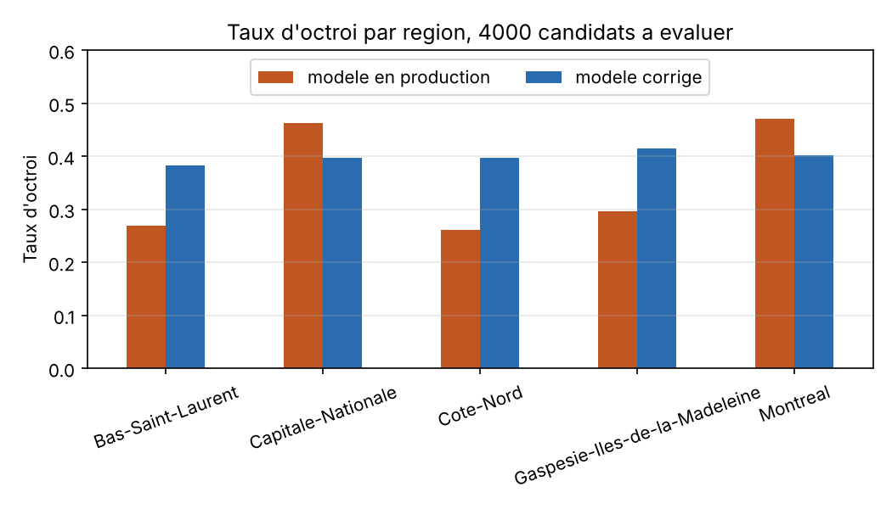
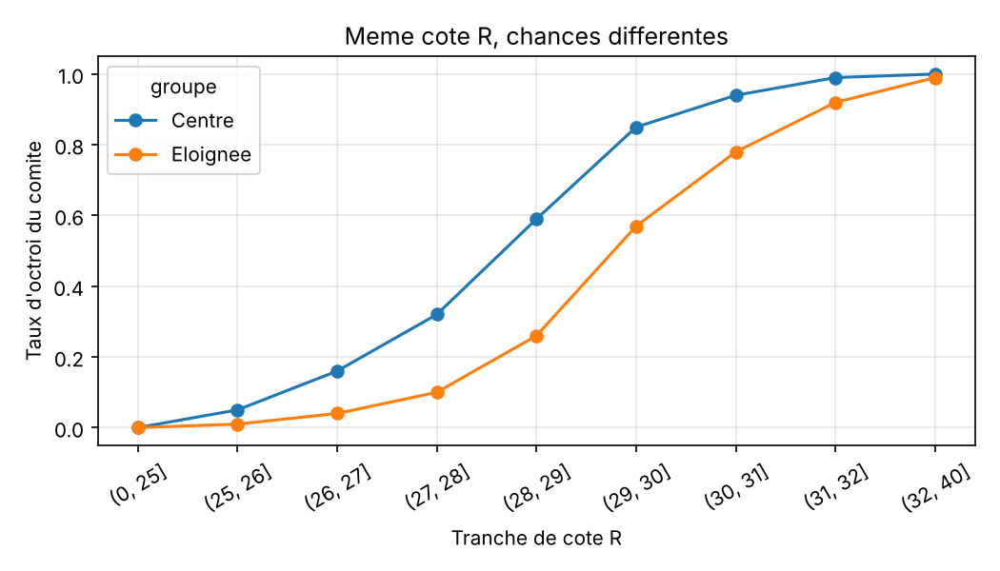
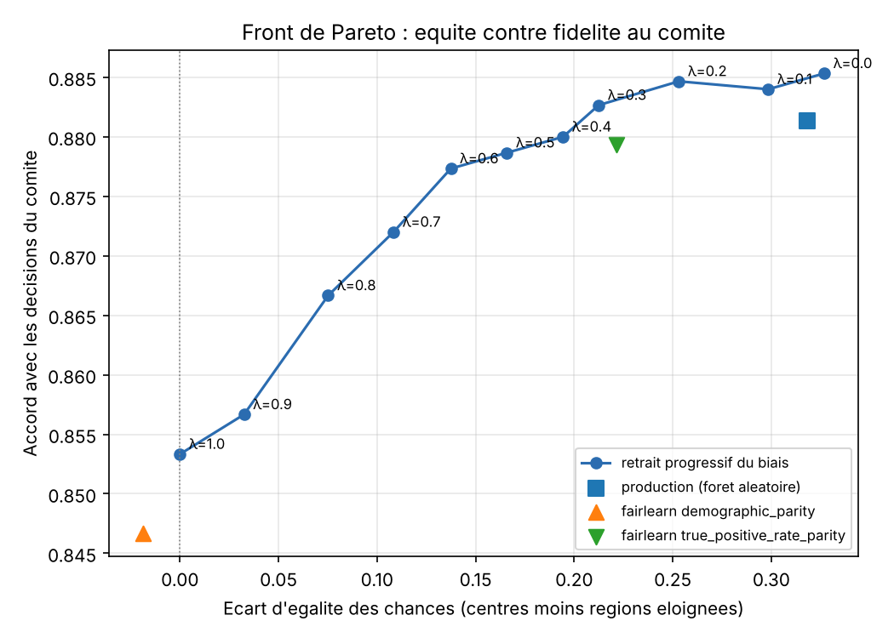

# ÉquiAlgo : des bourses au mérite, peu importe la région

Projet pour le défi **IVADO ÉquiAlgo** (CodeML 2026), équipe **Side Quest**.

Une institution financière québécoise utilise un modèle pour accorder des bourses. Il donne une bourse à 48 % des candidats de Montréal et de Québec, mais seulement à 27 % des candidats du Bas-Saint-Laurent, de la Côte-Nord et de la Gaspésie. On a cherché pourquoi, on l'a mesuré, et on l'a corrigé.



## En bref

- **Le biais :** à dossier égal, habiter en région éloignée coûte environ **1,4 point de cote R**. Le comité donne aussi une **prime aux familles aisées** (doubler le revenu vaut 0,9 point de cote R). Comme le revenu est plus bas en région, ça pénalise les régions une deuxième fois.
- **Pourquoi enlever la colonne région ne marche pas :** le code postal et la distance devinent la région presque à 100 %. Le modèle apprend à copier le comité, donc il retrouve le biais par ces autres colonnes.
- **Notre correction :** on ne copie plus le comité. On classe les candidats avec un score de mérite simple et lisible :

  **score = cote R + 0,145 × heures travaillées par semaine**

  On accorde la bourse aux 1600 meilleurs (40 % des 4000 candidats). Pas de région, pas de code postal, pas de distance, pas de revenu.
- **Résultat :** entre 38 % et 42 % de bourses dans chaque région. L'écart d'égalité des chances passe de 0,32 (modèle en production) à presque 0. Score indicatif contre l'étalon de référence : **94,63 % d'exactitude, 94,40 % de F1 macro**.

## Contenu du dépôt

| Fichier | Contenu |
|---|---|
| `predictions.csv` | nos décisions pour les 4000 candidats (40,0 % d'octroi) |
| `audit_rapport.ipynb` | mesure du biais, proxys, métriques d'équité et justification de notre choix |
| `model_corrige.py` | la correction, le front de Pareto et la création de `predictions.csv` |
| `presentation.pdf` | support du pitch de 5 minutes |
| `docs/gouvernance.md` | plan de suivi en production : indicateurs, alertes, rôles, recours |
| `docs/devpost.md` | les textes de notre page Devpost |
| `experiences/scores_indicatifs.csv` | tous nos essais et leur score indicatif |
| `experiences/front_pareto.csv` | les chiffres du front de Pareto |
| `figures/` | les graphiques |
| `baseline_model.ipynb` | le carnet de départ fourni par les organisateurs |
| `data/` | les données du défi |

## Lancer le projet

```bash
python3 -m venv venv
source venv/bin/activate          # Windows : venv\Scripts\activate
pip install -r requirements.txt
python model_corrige.py           # recrée predictions.csv et les figures
jupyter notebook audit_rapport.ipynb
```

Python 3.10 ou plus. Tout tourne en moins d'une minute.

## La démarche

### 1. Diagnostic

On a modélisé la décision du comité avec une régression logistique. Une forêt aléatoire ne fait pas mieux (88,1 % contre 88,7 %). La logistique décrit donc bien le comité, et on peut lire ses coefficients :

| Facteur | Effet, en points de cote R | Mérite ou biais ? |
|---|---|---|
| Cote R | 1 point = 1 point | mérite |
| Heures travaillées | +0,145 par heure par semaine | mérite (effort) |
| Revenu familial | +0,9 si le revenu double | biais |
| Région éloignée | -1,4 | biais |
| Programme, 1re génération | aucun effet | rien |



Entre 28 et 29 de cote R, un candidat de Montréal ou de Québec obtient la bourse 59 % du temps. Avec la même cote, un candidat des régions l'obtient 26 % du temps.

### 2. Les proxys

| Variable | AUC pour deviner la région |
|---|---|
| Code postal | 1,00 |
| Distance domicile-campus | 0,997 |
| Heures travaillées | 0,80 |
| Revenu familial | 0,65 |

Enlever la région et le code postal fait seulement passer l'écart de parité de 0,188 à 0,173. Tant qu'on entraîne sur `decision_octroi`, le biais revient. Il faut changer la cible, pas seulement enlever des colonnes.

### 3. Pourquoi l'égalité des chances

On a choisi l'**égalité des chances** : à mérite égal, même chance d'avoir la bourse, quelle que soit la région. La parité démographique aurait imposé un quota, donc refusé des dossiers plus forts pour atteindre un chiffre. Les deux ne peuvent pas être vraies en même temps, car la cote R moyenne est un peu plus basse en région.

### 4. Le front de Pareto

On retire le biais petit à petit (lambda de 0 à 1). À chaque pas, on mesure l'écart d'égalité des chances et l'accord avec le comité historique. On compare aussi avec deux corrections fairlearn (ThresholdOptimizer).



On a choisi **lambda = 1** : tout le biais est retiré. On perd 3 points d'accord avec le comité, mais c'est voulu : le comité est justement ce qu'on audite.

### 5. Validation

`decision_octroi` est biaisé, donc on ne peut pas s'en servir pour valider. On a utilisé le score indicatif de la plateforme (calculé contre l'étalon indépendant) pour tester une idée à la fois : poids des heures, revenu, région, distance, programme. Chaque ajout a fait baisser le score. Le détail est dans `experiences/scores_indicatifs.csv`.

| Essai | Exactitude |
|---|---|
| Formule du comité, sans la région | 92,53 % |
| Cote R seule | 92,23 % |
| **Cote R + 0,145 × heures (retenu)** | **94,63 %** |
| + bonus région éloignée | 93,68 % |
| + bonus distance | 93,03 % |

## Limites

- La définition du mérite est un choix de valeurs. Elle doit être validée par des humains.
- L'égalité des chances se mesure par rapport à notre référence de mérite. Le score externe reste notre vrai contrôle.
- La cote R elle-même peut porter un biais régional. On ne le corrige pas ici.
- Les données sont synthétiques : tout est à revalider sur des données réelles.

Le plan de suivi en production est dans [docs/gouvernance.md](docs/gouvernance.md).
